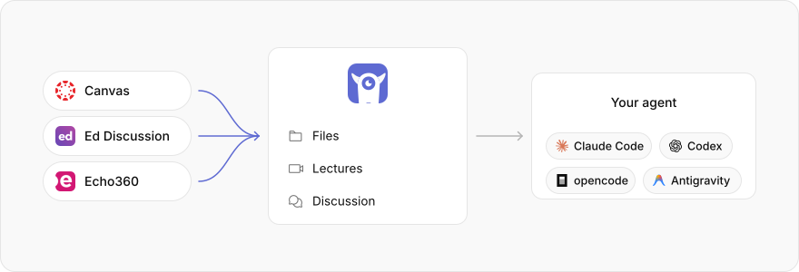
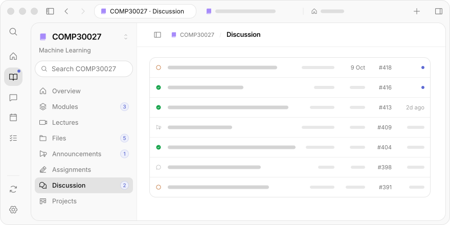
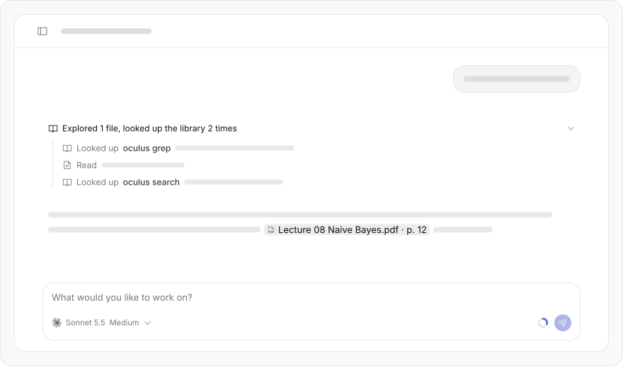
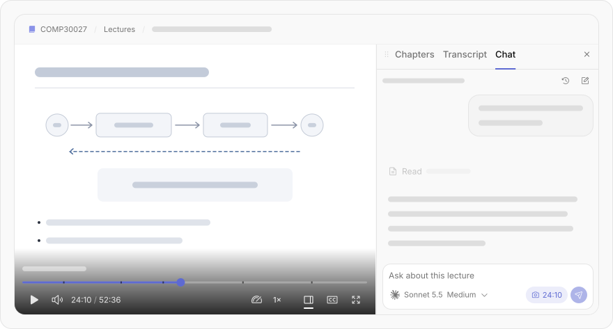
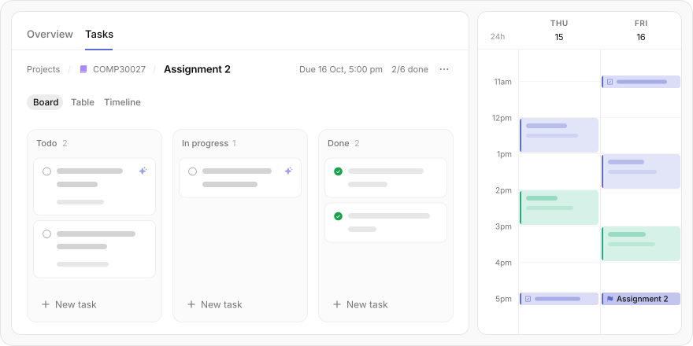

<div align="center">

<picture>
  <source media="(prefers-color-scheme: dark)" srcset=".github/assets/banner-dark.svg">
  
</picture>

<p>
  <a href="#run-it"><strong>Run it</strong></a>
  &nbsp;·&nbsp;
  <a href="docs/index.md"><strong>Docs</strong></a>
  &nbsp;·&nbsp;
  <a href="https://github.com/Tchanwangsa/oculus/issues/new"><strong>Report a bug</strong></a>
</p>

<p>
  &nbsp;
  <a href="https://tauri.app/"></a>&nbsp;
  <a href="https://www.rust-lang.org/"></a>&nbsp;
  <a href="https://www.typescriptlang.org/"></a>&nbsp;
  <a href="https://bun.sh/"></a>
</p>

</div>

## About

Your whole degree in one app. Oculus signs in to Canvas as you, brings in your
subjects, Ed threads and lecture recordings, and puts an AI assistant right
next to all of it.



## Your subjects, in one place

Pages, files, modules, assignments, announcements, Ed Discussion threads and
lecture recordings, all synced per subject and kept up to date. Every PDF is
turned into Markdown, so you and your agent can actually read it.



## Chat with your coursework

Use the coding agent you already have — Claude Code, Codex, opencode or
Antigravity. It runs inside your library with the `oculus` CLI as its tool, and
you can see every step it takes.



## An assistant in every lecture

Recordings download and play in-app, with the chat open beside them. Ask about
the bit you just missed and it answers from the lecture itself.



## Projects and calendar

Break an assignment into tasks on a board, table or timeline, and see classes
and due dates on one calendar. Your agent can plan with you there too.



### Also

- Drop in your own files — old exams, handouts — and they work like synced ones
- An in-app browser that's already signed in to Canvas
- A headless `oculus` CLI with the same engine

### Where your data goes

No Oculus server, no Oculus account — your library stays on your Mac. Only
two things leave it: PDFs, if you parse with MinerU's cloud rather than a MinerU
you run yourself, and page images, if you turn on embedding (Voyage).

## Platform

Mac first for now. Windows support is a main priority.

## Run it

Downloads are coming soon. Until then you can run it from source — you'll
need [bun](https://bun.sh), [Rust](https://rustup.rs) and
[sccache](https://github.com/mozilla/sccache) (`brew install sccache`).

```bash
cd app
bun install
bun run tauri dev
```

The first build is slow (a few hundred crates); after that it's quick.
[docs/development.md](docs/development.md) has the rest.

## Docs

[docs/index.md](docs/index.md) is the map — what lives where and why.

## License

Not picked yet. The plan is to open the source up for non-commercial use, with
credit. Until a license lands, all rights are reserved.

## Use it sensibly

Oculus isn't affiliated with or endorsed by the University of Melbourne. It
signs in as you, to material you already have access to, and your session stays
on your own machine.

Use it at your own risk, and in line with your university's rules on AI use
and academic integrity. Oculus and its authors take no responsibility for how
it's used, or for anything that happens to your university accounts (Canvas,
Ed, Echo360) along the way — including access being limited or blocked.
